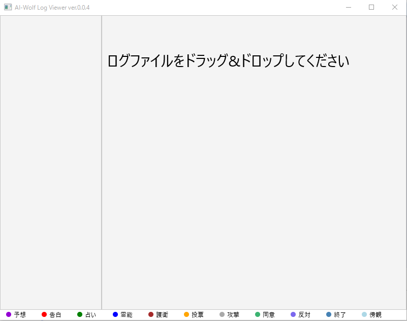

# AiWolfAnalysis（人狼知能解析ビューアー）

##説明と外観

　横にスクロールするときは、右側のプロットしているほうのPaneをクリックして左右キーで動きます。
(現在、画面が見づらくなるため、スクロールバーがない状態です。)
　また、●で表示されているのが会話(TALK)で、■で表示されているのがささやき(WHISPER)です。

　ドラッグ&ドロップに対応しました。
 　/jar/AiWolfAnalysis.jarの実行ファイルから動きます。今まで通りソースにログファイルが設定して実行することも可能です。

##更新履歴
|2015/10/13 |D&D対応、マーカーの色を調整   |ver.0.0.4|
|-----------|:------------------------|---------|
|2015/10/10 |色やUIを調整、GitGub公開    |ver.0.0.3|
|           |Paneを分割                |ver.0.0.2|
|           |プロトタイプ作成              |ver.0.0.1|